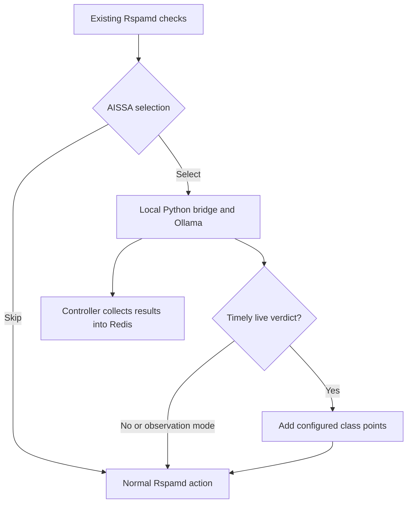

# AISSA — AI Sample Spam Analyzer

Experimental LLM-assisted email analysis for **Rspamd and Postfix**. AISSA selects
messages using existing filter signals, analyzes their content with a local
Ollama model, and can add configurable points while respecting the remaining
Rspamd scan budget.

**The integration works; classifier reliability is still under evaluation.**
The tested Qwen 2.5 1.5B model has missed real scam mail and produced false
positives and invented explanations. Start in observation mode. Unit tests
verify the integration, not the quality of model judgments.

[Source](https://github.com/frickl/aissa) ·
[Installation](docs/installation.md) ·
[Field notes](docs/field-notes.md) ·
[Evaluation](docs/aissa-evaluation.md) ·
[MIT license](LICENSE)

## Why this exists

Authenticating a sender does not establish that a message is legitimate. Scam
mail can pass SPF, DKIM and DMARC, while a legitimate forwarded message can fail
some checks. AISSA explores whether content analysis can provide useful
additional evidence without sending every message through an LLM or leaving
SMTP waiting indefinitely.

This is a project for mail administrators who want to measure that trade-off:
missed abuse, false positives, CPU cost and time spent waiting for a verdict.

## What is implemented

- Rspamd Lua selection by score range, symbols, URLs, supplied country metadata,
  account/IP counters and separate AI-suspicion/confirmed-abuse counters.
- Sampling and raw-message size limits after selection.
- An authenticated loopback Python bridge with admission, queue and result limits.
- Bounded MIME text extraction, local Ollama classification and validated JSON.
- Observation mode and optional live scoring with configurable class weights.
- Live waiting capped against the global Rspamd task timeout, with a completion
  reserve; errors and timeouts add status information rather than a ham verdict.
- Independent result collection and deduplicated Redis updates through Rspamd's
  existing Redis configuration.

Both incoming MX and Submission scans can use the integration. Your existing
MTA/Rspamd settings must actually invoke it on each path.

## Processing flow



AISSA does not directly force reject, greylist, acceptance or account suspension.
In live scoring mode, its points can affect the action chosen by existing
Rspamd rules. After an SMTP transaction finishes, a later model result cannot
retroactively reject that message.

## What the measurements show

During manual testing on a CPU-only server with Qwen 2.5 1.5B:

| Case | Observed result |
|---|---|
| Explicit demand for a password and current 2FA code | Classified as phishing; live points contributed to rejection |
| Ordinary meeting arrangement | Classified as ham; no additional points |
| Real donation offer directing replies to an unrelated Gmail address | Classified as ham with confidence 1.0; missed suspicious content |
| Long undeclared Base64 body | Slow inference; some outputs invented links or virus evidence |

A short cold phishing request took about **15 seconds**; a warm repeat took
about **2.5 seconds**. A changed meeting message took **4.2 seconds**, reusing
456 of 536 input tokens. These are individual observations, not accuracy or
throughput benchmarks. See [field notes](docs/field-notes.md) for context.

The donation mail also exposed a separate selection limitation: its negative
Rspamd score kept it outside the configured 3-to-under-15 range. Selecting it
would not have fixed the incorrect model verdict. Selection, classification and
score impact must each be evaluated.

## Try it safely

Requirements: an existing Rspamd/Redis installation, Python 3.11 or newer and
local Ollama. The Python code has no additional package dependencies.

```bash
python3 -m unittest discover -s tests -v
python3 -m aissa samples/phish-fr.eml
```

The CLI calls Ollama directly and prints its explanation. For MTA integration,
follow [installation](docs/installation.md), start with
`scoring_enabled = false`, and verify the effective configuration and real SMTP
responses. The repository example configuration requires review before use; it
contains duplicate `enabled` entries and enables live scoring. Do not copy it
blindly into production.

## Limits that matter

- Confidence is an uncalibrated model self-assessment, not a probability of abuse.
- Body text and URL prefixes share a 1,000-character budget by default;
  truncation may hide decisive evidence. Layout padding is cleaned before clipping.
- No attachment inspection, virus scanning, OCR, URL fetching or account locking.
- Prompt instructions do not guarantee resistance to invented evidence or prompt
  injection from hostile mail content.
- Queue/results/cache are RAM-only and disappear on bridge restart.
- Model processing can continue after the live scan budget expires.
- The global scan-budget cap is not a hard deadline for the entire SMTP/Milter
  chain; narrower task/worker limits and host stalls need separate validation.

The currently implemented backend is **local Ollama**. OpenAI, Claude and
DeepSeek adapters and comparative evaluations are proposed work, not existing
features. Using an external backend would send selected mail content off-host.

## Contribute

Useful contributions include:

- Independently labeled, privacy-reviewed mail cases, including legitimate
  newsletters, multilingual correspondence and authenticated scam mail.
- Model comparisons that report false positives and missed abuse alongside
  latency, hardware, model tag and prompt version.
- Integration results from other Rspamd versions and actual SMTP paths.
- Queue expiration/cancellation, additional selection criteria and optional
  API backends, with explicit timeout and data-handling behavior.

Open an [issue](https://github.com/frickl/aissa/issues) with a reproducible case
or send a pull request. Do not publish private mail, credentials or personal
addresses in issues or evaluation results. Discuss broader changes before
implementation.

## Documentation

- [Installation and operations](docs/installation.md)
- [Architecture, Redis and reputation](docs/architecture.md)
- [MIME extraction and shared input budget](docs/extraction.md)
- [Live scoring and timeout behavior](docs/aissa-scoring.md)
- [Classifier evaluation](docs/aissa-evaluation.md)
- [Offline model and thread comparison](docs/model-comparison.md)
- [Measured field notes](docs/field-notes.md)
- [Static project page and deployment](website/README.md)

Maintained by **Gunther Nitzsche** (`frickl`). MIT licensed.
If this helps you and we meet, buy me a beer.
